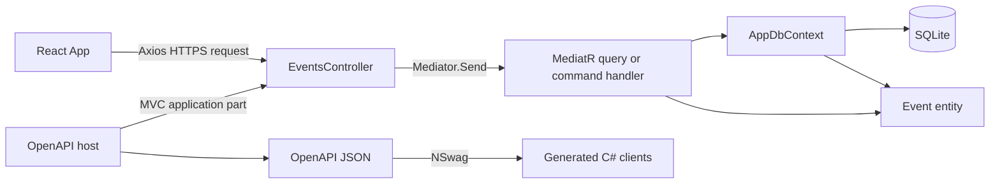

# EventsHub

ICI 2026 01. An event management project with an ASP.NET Core API, SQLite storage,
and a React frontend. The API supports creating, listing, editing, and deleting
events; the current frontend displays event titles fetched from the API.

## Repository layout

| Path | Purpose |
| --- | --- |
| `src/EventsHub.Api/` | HTTP controllers, dependency registration, CORS, and database startup |
| `src/EventsHub.Application/` | MediatR queries and commands; AutoMapper configuration |
| `src/EventsHub.Domain/` | The `Event` entity |
| `src/EventsHub.Persistence/` | EF Core `AppDbContext`, SQLite migrations, and sample data |
| `src/EventsHub.OpenApi/` | Separate NSwag documentation host that discovers the API controllers |
| `src/openapi/EventsHub.v1.json` | Checked-in OpenAPI snapshot |
| `src/nswag/EventsHub.nswag` | C# client generation configuration |
| `src/src/EventsHub.OpenApi/Generated/` | Current generated C# client output |
| `web/` | React, TypeScript, Vite, Material UI, and Axios frontend |
| `tests/EventsHub.UnitTests/` | NUnit controller tests with SQLite setup |
| `tests/EventsHub.IntegrationTests/` | Bruno HTTP request collection |

## How the components connect



`EventsHubBaseController` supplies the `api/v1/[controller]` route and resolves
`IMediator` from request services. Application handlers access `AppDbContext`;
`EditEvent` also uses AutoMapper to copy the submitted fields onto the stored
entity. The API registers these services in `Program.cs`.

The OpenAPI host loads the API assembly to describe its controllers. It does
not register the API's MediatR or database services, so use the main API for
event requests. The React frontend calls the main API directly through Axios.

## Run locally

Prerequisites:

- .NET 10 SDK (the backend projects target `net10.0`).
- Node.js `^20.19.0` or `>=22.12.0`, as required by the locked Vite dependency,
  and npm.

Run these commands from the repository root unless indicated otherwise.

### Start the API

```powershell
dotnet restore src/EventsHub.Api/Eventshub.Api.csproj
dotnet dev-certs https --trust
dotnet run --project src/EventsHub.Api/Eventshub.Api.csproj --launch-profile https
```

The API listens at `https://localhost:5001`. At startup it applies EF Core
migrations and seeds ten sample events if the events table is empty. The
connection string is `Data source=EventsHub.db` in
`src/EventsHub.Api/appsettings.json`; the database path is relative to the
process's working directory. Override it with
`ConnectionStrings__SqliteConnection` when a different location is needed.

### Start the frontend

In another terminal:

```powershell
cd web
npm ci
npm run dev
```

Open the local URL printed by Vite, normally `https://localhost:3000`. The
frontend uses `vite-plugin-mkcert` for its development certificate. The API
allows CORS requests from `http://localhost:3000` and
`https://localhost:3000`; keep that port available.

See the [frontend README](web/README.md) for scripts, source layout, and
connection troubleshooting.

## API endpoints

Routes below are relative to `https://localhost:5001`. `POST` and `PUT` accept
an `Event` JSON body; `PUT` identifies the event through its body `id`.

| Method | Route | Successful response |
| --- | --- | --- |
| GET | `/api/v1/events` | `200` with the event array |
| GET | `/api/v1/events/{id}` | `200` with one event |
| POST | `/api/v1/events` | `200` with the created event ID |
| PUT | `/api/v1/events` | `204` with no body |
| DELETE | `/api/v1/events/{id}` | `200` with no body |
| GET | `/api/v1/weatherforecast` | `200` with sample weather forecasts |

An example create body:

```json
{
  "title": "Community meetup",
  "date": "2026-10-15T18:00:00",
  "description": "An evening meetup",
  "category": "culture",
  "isCancelled": false,
  "city": "Ciudad de México",
  "venue": "Zócalo",
  "latitude": "19.4326",
  "longitude": "-99.1332"
}
```

Omitting `id` on creation uses the entity's generated GUID string. Coordinates
are strings in the backend model and JSON contract. Missing events currently
cause handlers to throw exceptions; the declared `404` responses are not
implemented through exception handling.

## OpenAPI and C# client generation

Restore the checked-in local NSwag tool, then start the documentation host:

```powershell
dotnet tool restore
dotnet run --project src/EventsHub.OpenApi/EventsHub.OpenApi.csproj --launch-profile EventsHub.OpenApi
```

The launch profile serves `https://localhost:5011` and `http://localhost:5010`.
Open `http://localhost:5010/swagger` for Swagger UI. In another terminal at the
repository root, export the specification:

```powershell
Invoke-WebRequest -Uri http://localhost:5010/swagger/EventsHub/swagger.json -OutFile src/openapi/EventsHub.v1.json
```

Stop the documentation host with Ctrl+C, then generate the clients:

```powershell
dotnet tool run nswag run src/nswag/EventsHub.nswag
```

The configuration resolves paths relative to `src/nswag/`. Its current output
is `src/src/EventsHub.OpenApi/Generated/EventsHubRpcClient.generated.cs`, outside
the actual OpenAPI project directory. The checked-in snapshot and client
currently include only GET operations and need regeneration to include the
write endpoints. Treat the JSON snapshot and generated C# file as generated
artifacts.

## Build and test

```powershell
dotnet build src/EventsHub.Api/Eventshub.Api.csproj
dotnet build src/EventsHub.OpenApi/EventsHub.OpenApi.csproj
dotnet test tests/EventsHub.UnitTests/EventsHub.UnitTests.csproj
cd web
npm run lint
npm run build
```

The NUnit controller tests resolve MediatR and the mapper through request
services and pass the list action's cancellation token. They cover listing,
details, and the current exception for a missing event. Global test setup uses
a real SQLite database and seeds it.

For manual HTTP checks, open
`tests/EventsHub.IntegrationTests/opencollection.yml` in Bruno and select the
`local` environment, whose `baseUrl` is `https://localhost:5001/api/v1`.
Review the assertions before relying on the collection: some request names and
expected responses are inconsistent with the current API.
